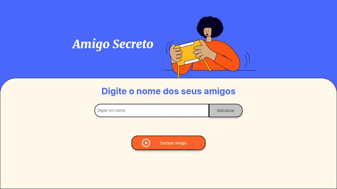
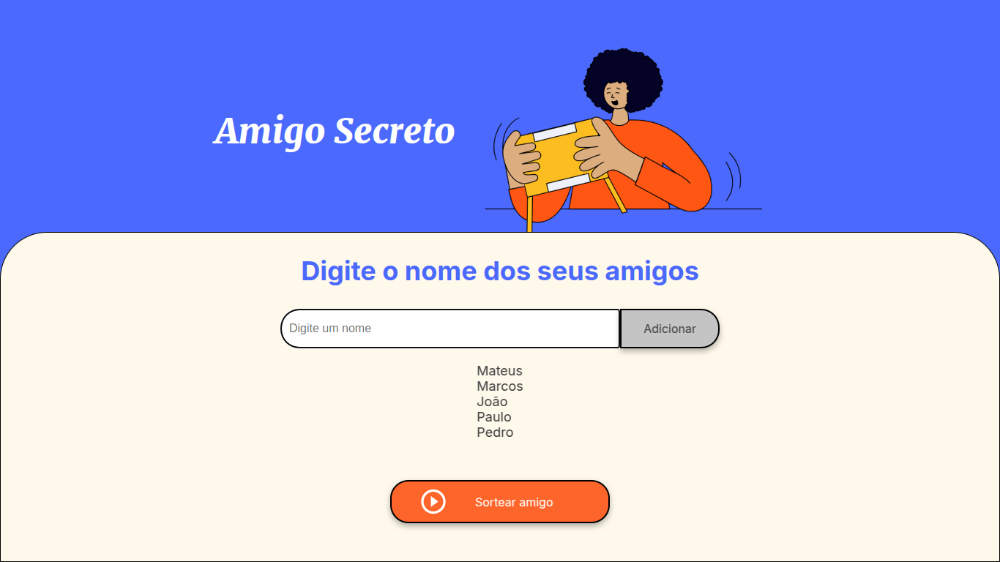
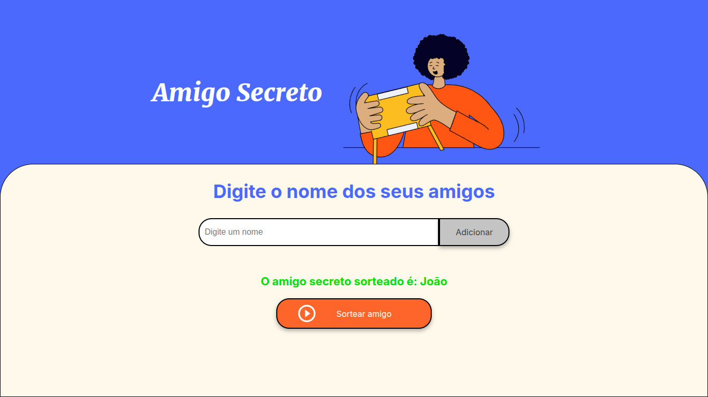

# Challenge Amigo Secreto
Uma aplicação desenvolvida que permite aoa usuários inserir nomes de amigos em uma lista para, em seguida, realizar um sorteio aleatório e determinar quem é o "amigo secreto".
Para acessar a aplicação em produção [clique aqui](https://johabfreitas.github.io/challenge-amigo-secreto/).

## Sobre o projeto
Na aplicação desenvolvida foi aplicada os conceitos de lógica de programação, array, funções, utilização do DOM(Document Object Model) para manipular os elementos da página web. 
Foi o meu segundo projeto que trabalhei com a linguagem JavaScript, porém nesse projeto não tive muita dificuldade em desenvolver como no primeiro, isso se deu por nesse intervalo venho evoluíndo na programação, pois criei uma base muito boa estudando Kotlin, Java e Python. Aprendi também a trabalhar com o conceito dividir para conquistar, quebrar um problema em vários, e dessa forma solucionar o problema de um modo mais fácil.

### Instruções de uso
O usuário deverá adiconar nomes e clicando no botão "Adicionar", todos adicionados clicar no botão "Sortear amigo".

	

### Telas

	

	

	

## Tecnologias utilizadas
- Linguagem de programação JavaScript
- Linguagem de Marcação de Hipertexto, HTML
- Cascading Style Sheets, CSS

## Contribuição
Este repositório foi criado para fins de estudos, com base nas aulas do Programa ONE - Oracle Next Education -  Iniciante em Programação em parceria com [Alura](https://cursos.alura.com.br/).

Se quiser contribuir com o projeto, siga estas etapas:

1. Faça um fork do projeto;
2. Crie uma branch para sua feature (`git checkout -b feature/MinhaFeature`);
3. Faça commit das suas alterações (`git commit -am 'Adicione uma nova feature'`);
4. Faça push para a branch (`git push origin feature/MinhaFeature`);
5. Crie um novo Pull Request;

## Autor
Feito por Johab Freitas

